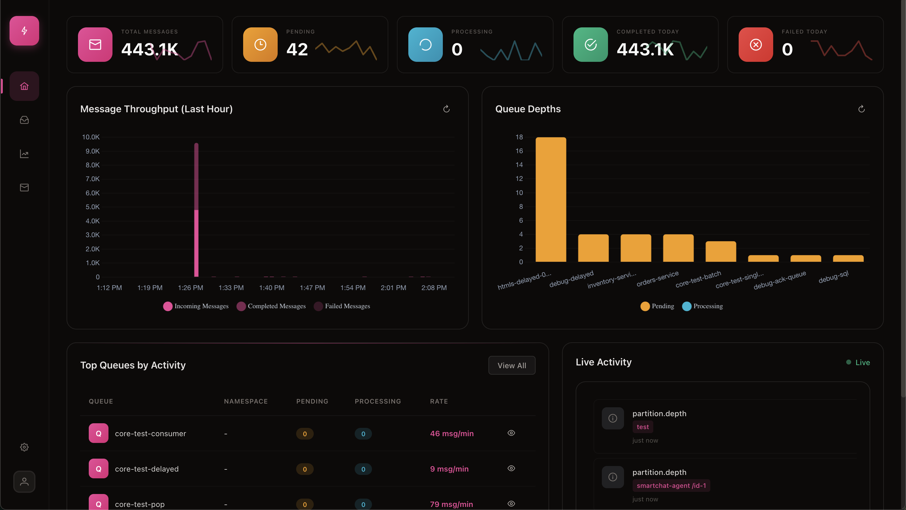
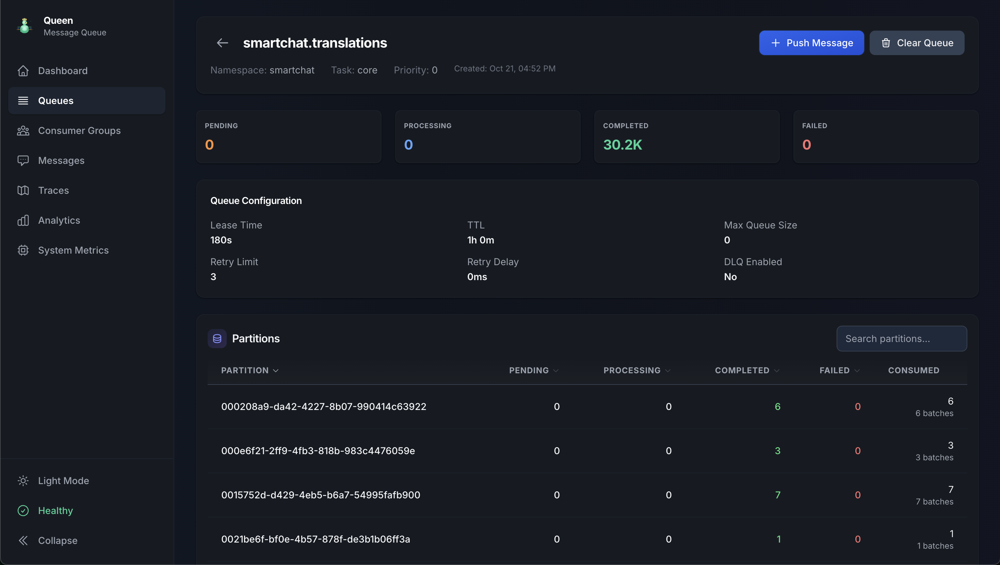
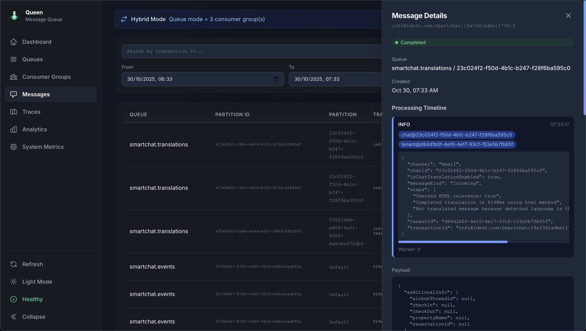
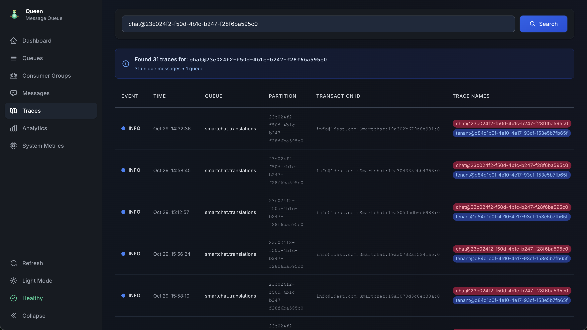
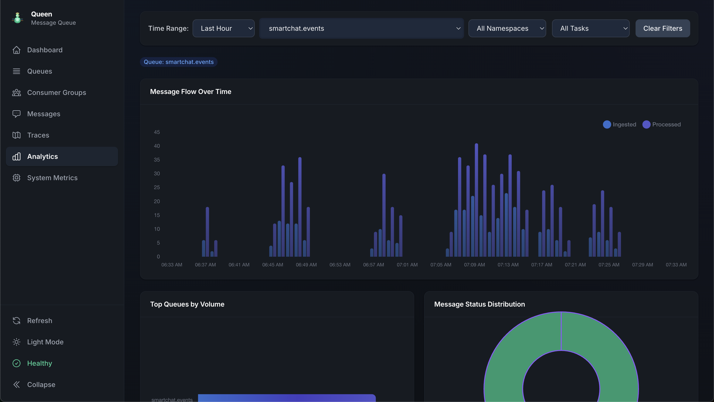
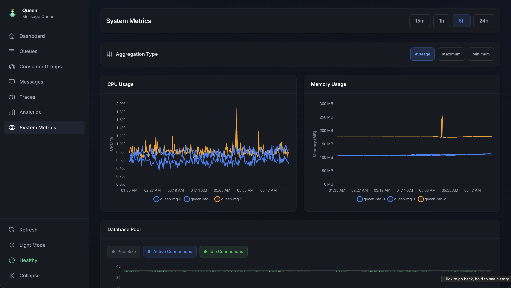

# Queen MQ - PostgreSQL-backed C++ Message Queue

<div align="center">

**A modern, performant message queue system built on PostgreSQL**

[](LICENSE.md)
[](https://nodejs.org/)
[](https://en.cppreference.com/w/cpp/17)

[Quick Start](#one-single-example) • [Complete V2 Guide](client-js/client-v2/README.md) • [Webapp](#webapp) • [Server Setup](#install-the-server-and-configure-it) • [HTTP API](#raw-http-api)

<p align="center">
  
</p>

</div>

---

Why "Queen"? Because years ago, when I first read the word "queue" in my mind, I read it as "queen".

---

[QUICKSTART](docs/QUICKSTART.md)

## Introduction

QueenMQ is a queue system written in C++ and backed by PostgreSQL, born from the need to manage many FIFO partitions for Smartchat with solid guarantees around delivery and failure handling. During the initial development, I realized that with a few simple additions to the original design, I could build a very powerful and flexible queue system. This project is almost entirely written by AI, with my supervision—only the test files (or a good part of them) are manually written.

Here are the main features:
- Unlimited FIFO partitions within queues
- Queue semantics like RabbitMQ
- Consumer groups over queues like Kafka
- Allows for all the patterns you need, from simple queues to complex workflows and request/response patterns
- QoS levels: Exactly-once delivery (with transactionId), at-least-once delivery, and at-most-once delivery
- Subscription modes for replay (new messages only or from a specific timestamp) and message history control
- Transactions between operations (push and ack mainly) for atomicity
- Dead letter queue for failure handling
- Lease renewal for long-running tasks
- Message tracing for debugging workflows
- Encryption of messages at DB level
- Automatic message retention and cleanup - Configurable per-queue retention policies
- Streaming capabilities for real-time aggregation and processing of messages
- A nice webapp for monitoring and managing the system
- Maintenace mode that allows to continue pushing messages even when the database is down, and to drain the messages to the database when the maintenance mode is disabled

The system consists of a PostgreSQL database, a replicated server that can be scaled horizontally (though it won't be the bottleneck), and a client library for interacting with the server. All client-server communication happens over HTTP, and the client library are available for JavaScript and C++ (Other languages like Python are planned). There's also a modern Vue 3 web app for monitoring and managing the system.

With proper batching, the system can handle +200k **messages** per second (not req/s) on modest hardware.

Main documentation:
- [Client Guide JS](client-js/client-v2/README.md)
- [Client Guide C++](client-cpp/README.md)
- [Server Guide](server/README.md)
- [Streaming Guide](docs/STREAMING_USAGE.md)
- [API Reference](server/API.md)
- [Message Retention & Cleanup](docs/RETENTION.md)
- [Webapp](webapp/README.md)
- [Expose the Webapp behind a proxy](proxy/README.md)

## Concepts

Although the system is designed to be simple to use (not really), there are some concepts that are important to understand to use the system effectively.

### Queues

Queues are a way to organize your messages into logical groups. Each queue is like a container for messages. You can have as many queues as you want, and you can configure each queue with different settings, like the lease time, retry limit, encryption, retention, priority, delayed processing, window buffer and retention.

### Partitions

Partitions are a way to organize your messages into logical ordered groups. Each partition is like a separate queue inside a queue, and messages in the same partition are guaranteed to be processed in order. Only one consumer/client can acquire the lock for a partition at a time. You can have as many partitions as you want, and you can have as many consumers/clients as you want. If the lease in not acknowledged in time, the message is released and can be acquired by another consumer/client. Use renewLease() to renew the lease during long-running tasks. Each different consumer group can acquire the lock for a partition independently, so you can have as many consumer groups as you want.

### Default partition and consumer group

The default partition (if not specified) is `Default`. If you don't specify a consumer group, the messages are processed in queue mode, that is creating a default consumer group named `__QUEUE_MODE__`. Each queue can be used at the same time by multiple consumer groups, and each consumer group can process messages from multiple partitions.

### Consumer groups

Consumer groups are a way to process messages for different purposes. Each consumer group is like a separate queue, and messages in the same consumer group partition are guaranteed to be processed in order. Each consumer group tracks its own position in the queue. You can start a consumer group from the beginning of the queue, from a specific timestamp, or only new messages.

### Subscription modes

Subscription modes are a way to control the message history that is processed. You can choose to process all messages (including historical ones), only new messages, or messages from a specific timestamp. Subscription modes are only available when using consumer groups.

### Long polling (waiting for messages)

The client works with the pull model for pop operations, meaning that you need to explicitly request messages from the queue. Pop and consume mehtods can "wait" server side for messages to be available. When the method is called with wait=true, the method will block until messages are available or the timeout is reached. When the timeout is reached, the method returns an empty array. Long polling is a very efficient way to wait for messages, and it is the recommended way to consume messages.

### Lease renewal

Lease renewal is a way to keep the lock for a partition or consumer group alive. You can use lease renewal to prevent the lock from expiring and being acquired by another consumer/client.

### Ack and Nack

Ack and Nack are the way to acknowledge or not a message. Ack means that the message has been processed successfully, and Nack means that the message has not been processed successfully. Ack/Nack requires the partitionId, the transactionId and the leaseId to be specified. If the ack is coming from a consumer group, the consumer group name is also required. This logic is handled automatically by the client library, you don't need to worry about it. If the message has already been acknowledged, the ack will be ignored. Based on the configuration, the message can be automatically acknowledged or manually acknowledged.

### Transactions

Transactions are a way to ensure that a group of operations are atomic. You can use transactions to ensure that a group of operations are executed together, and if one of the operations fails, the entire transaction is rolled back. Transactions are useful to achieve the exactly-once guarantee. You can process a message on a queue, and forward to the next queue only if the consumer lease is still valid, concatenating ack and push into a single transaction.

### Dead letter queue

The dead letter queue is a way to handle messages that are not processed successfully. When a message is not processed successfully, it is moved to the dead letter queue. Messages goes in the DLQ when they are NACK after the retry limit is reached. You configure the retry limit for each queue at queue config.

## Comparison with RabbitMQ, Kafka, and NATS

For users familiar with existing message queue systems, here's how Queen's semantics and usage patterns compare:

### Conceptual Mapping

| Queen Concept | RabbitMQ Equivalent | Kafka Equivalent | NATS Equivalent |
|---------------|---------------------|------------------|-----------------|
| Queue | Queue | Topic | Stream (JetStream) |
| Partition | N/A (queues are single-consumer by default) | Partition | N/A |
| Consumer Group | Competing Consumers pattern | Consumer Group | Queue Group |
| Queue Mode (no group) | Exclusive consumer | N/A (always uses groups) | Single subscriber |
| Lease | Message TTL / Visibility timeout | N/A (commit-based) | Ack wait / nak delay |
| Ack/Nack | Ack/Nack | Commit offset | Ack/Nak |
| Transaction | Publisher confirms + consumer acks | Transactional producer/consumer | N/A |
| Dead Letter Queue | Dead Letter Exchange | N/A (manual) | N/A (manual) |


## One single example

> 📖 **[Complete Guide: client-js/client-v2/README.md](client-js/client-v2/README.md)** - Full tutorial with all features!

```javascript
import { Queen } from 'queen-mq'

// Connect to Queen
const queen = new Queen('http://localhost:6632')

// Create a queue
await queen
.queue('critical-task')
.config({
  leaseTime: 10, // 10 seconds to process the messages (seconds)
})
.create()

// Push messages
await queen
.queue('critical-task')
.partition('tenant-123')
.push([
  { 
    transactionId: 'my-id', // This is autogenerated, but you can set your own. Unique per queue partition.
    data: { id: 123, description: 'Critical task' }  // The message payload
  },
])
.onSuccess(async (messages) => { // Not mandatory
  console.log('Messages pushed successfully:', messages)
})
.onDuplicate(async (messages) => { // Not mandatory, triggered when a message with the same transactionId is pushed
  console.warn('Duplicate transaction IDs detected')
})
.onError(async (messages, error) => {  // Without callbacks, push throws an error if some messages are not pushed
  console.error('Error pushing messages:', error)
})

// Consume messages
await queen
.queue('critical-task')
// The consumer group name, without this, the messages are processed in queue mode
.group('processor-consumer-group') 
// 10 parallel workers
.concurrency(10)
// I want to manually ack/nack messages 
.autoAck(false) 
// 10 messages per batch, prefetch them
.batch(10) 
// Auto-renew the lease for the messages every 2 seconds
.renewLease(true, 2000) 
// Process each message individually
.each() 
// Do your work here
.consume(async (message) => {
  console.log('Processing:', message.data) 
})
// Ack the messages if you processed them successfully
.onSuccess(async (message) => {
  await queen
  .transaction()
  .queue('critical-task-next')
  .partition('XXX')
  .push([{ data: { message: 'Final', count: 3 } }])
  .ack(message)
  .commit()  
})
// Nack the messages if you failed to process them
.onError(async (message, error) => {
  console.error('Error processing messages:', error)
  await queen.ack(message, false)
})
```

## Webapp

A modern Vue 3 web interface for managing and monitoring Queen MQ. 



 

 

 

 

 

**Features:**
- 📊 Real-time dashboard with system metrics
- 📈 Message throughput visualization
- 🔍 Queue management and monitoring
- 👥 Consumer group tracking
- 💬 Message browser with trace timeline
- 🔎 **Trace explorer for debugging distributed workflows**
- 📉 Analytics and insights
- 🌓 Dark/light theme support

**Quick Start:**
```bash
cd webapp
npm install
npm run dev
```

The dashboard will be available at `http://localhost:4000` or at `http://localhost:6632` directly from the server.

See [webapp/README.md](webapp/README.md) for more details.

## Architecture

Queen uses a high-performance **acceptor/worker pattern** with uWebSockets, featuring a **fully asynchronous, non-blocking PostgreSQL architecture** for maximum throughput and minimal latency.

### Core Components

**Network Layer:**
- **UWS Acceptor**: Single thread listening on port 6632, distributes connections round-robin to workers
- **UWS Workers**: Configurable event loop threads (default: 10) handling HTTP routes and WebSocket connections

**Database Layer:**
- **AsyncDbPool**: Non-blocking PostgreSQL connection pool (142 connections) using libpq async API
  - Socket-based I/O with `select()` for non-blocking operations
  - RAII-based resource management with automatic connection cleanup
  - Connection health monitoring and automatic reset
  - Thread-safe with mutex/condition variable synchronization
- **AsyncQueueManager**: Event-loop-based queue operations
  - Direct execution in worker threads for PUSH, POP, ACK, and TRANSACTION operations
  - Batch processing with dynamic sizing
  - Encryption support with status checks
  - Automatic failover to file buffer when database unavailable

**Background Services:**
- **Poll Workers**: 4 dedicated threads for long-polling operations
  - Non-blocking I/O with exponential backoff (100ms→2000ms)
  - Intention registry for efficient request grouping
  - Rate-limited queries to prevent database overload
- **Background Pool**: 8 connections for metrics, retention, eviction, and stream management

### Request Flow

**Standard Operations (PUSH/POP/ACK/TRANSACTION):**
```
Client Request
    ↓
Acceptor (port 6632)
    ↓
Worker (event loop) → AsyncQueueManager → AsyncDbPool → PostgreSQL
    ↓                  (non-blocking)      (socket I/O)
Response sent immediately
```

**Long-Polling Operations (wait=true):**
```
Client Request
    ↓
Worker registers intention in Registry
    ↓
Poll Worker (50ms interval)
    ↓
Non-blocking query via AsyncDbPool
    ↓
Messages distributed to waiting clients
```

### Performance Characteristics

**Latency:**
- **POP (immediate)**: 10-50ms
- **ACK**: 10-50ms
- **TRANSACTION**: 50-200ms
- **Long-polling**: Configurable (50ms-2000ms backoff)

**Throughput:**
- **Peak**: 148,000+ msg/s
- **Sustained**: 130,000+ msg/s
- **Batch push**: 5,000-8,000 msg/s (with batches of 100)

**Resource Usage:**
- **Database connections**: 150 total (142 async + 8 background)
- **Threads**: 14 total (10 workers + 4 poll workers)
- **Memory**: ~80MB for thread stacks + connection overhead

### Scalability

The event-driven architecture enables:
- ✅ Unlimited concurrent requests (limited only by connection pool)
- ✅ Horizontal scaling (multiple server instances)
- ✅ Efficient resource utilization (non-blocking I/O)
- ✅ Low latency under high load
- ✅ Automatic load distribution across workers

**📚 Technical Documentation:**
- [Server Architecture Guide](server/README.md) - Complete server setup and configuration
- [Architecture Diagrams](assets/architecture.svg) - Visual architecture overview

### PostgreSQL Failover

Queen automatically buffers messages to disk when PostgreSQL is unavailable - **zero message loss**:

- Normal pushes go directly to PostgreSQL (FIFO preserved)
- If PostgreSQL is down, messages buffered to file (macOS: `/tmp/queen`, Linux: `/var/lib/queen/buffers`)
- Automatic replay when PostgreSQL recovers
- Survives server crashes and restarts
- Directory auto-created on first run

**No configuration needed** - failover is automatic!

**Custom directory:**
```bash
FILE_BUFFER_DIR=/custom/path ./bin/queen-server
```

## Performance Benchmarks

**Preliminary results from C++ client benchmark** (detailed benchmarks on dedicated hardware coming soon)

### Test Environment
- **Hardware:** Apple M4 Air (all components on same machine, 10 processors available)
- **Server:** 1 server, 4 workers, 95 total DB connections/threads
- **Database:** PostgreSQL in Docker
- **Client:** C++ benchmark tool (`benchmark/bin/benchmark`)

### Results

| Mode | Threads | Messages | Batch Size | Partitions | Queue Mode | Throughput | Bandwidth |
|------|---------|----------|------------|------------|------------|------------|-----------|
| **Producer** | 100 | 10K | 1 | 100 | single-queue | **1,431 msg/sec** | 0.41 MB/sec |
| **Producer** | 100 | 10K | 1 | 100 | multi-queue | 527 msg/sec | 0.15 MB/sec |
| **Producer** | 10 | 1M | 1,000 | 100 | single-queue | **62,927 msg/sec** | 18.00 MB/sec |
| **Producer** | 10 | 1M | 1,000 | 100 | multi-queue | 49,663 msg/sec | 14.21 MB/sec |
| **Producer** | 10 | 1M | 1,000 | 10 | multi-queue | 42,663 msg/sec | 12.29 MB/sec |
| **Producer** | 10 | 1M | 10,000 | 10 | single-queue | 70,351 msg/sec | 19.68 MB/sec |
| **Consumer** | 10 | 1M | 1,000 | 100 | single-queue | **31,922 msg/sec** | 16.25 MB/sec |
| **Consumer** | 10 | 1M | 10,000 | 10 | single-queue | **105,974 msg/sec** | 53.70 MB/sec |

### Key Observations

- ✅ **Batch size matters:** Larger batches (1,000-10,000) dramatically improve throughput
- ✅ **Consumer performance:** Scales well with batch size (82K msg/sec with 10K batches)
- ✅ **Producer peak:** 62K msg/sec with optimal batch size (1,000)
- ⚠️ **Small batches:** Performance drops significantly with batch=1 (lock contention)

**Note:** All timing metrics exclude idle timeouts and measure actual message processing time (first message → last message).

### Run Your Own Benchmarks

```bash
cd benchmark
make

# Producer
./bin/benchmark producer --threads 10 --count 1000000 --batch 1000 --partitions 100 --mode single-queue

# Consumer
./bin/benchmark consumer --threads 10 --batch 1000 --partitions 100 --mode single-queue
```

See [benchmark/README.md](benchmark/README.md) for detailed usage.

## Install the server and configure it

### Quick Start

```sh
cd server
make clean
make deps
make build-only
DB_POOL_SIZE=50 ./bin/queen-server
```

**📖 Complete Build & Tuning Guide:** [server/README.md](server/README.md)

Includes:
- Build instructions and optimization
- Performance tuning (worker threads, database pool)
- Production deployment (systemd, Docker, load balancing)
- Troubleshooting common issues
- Benchmarking guides

### Environment Variables

[The full list of environment variables is here](server/ENV_VARIABLES.md)

### With Docker
```sh
./build.sh
```

### Running on k8s

[Running in k8s](server/k8s-example.yaml)

## 🔌 Raw HTTP API

You can use Queen directly from HTTP without the JS client.

[Here the complete list of API endpoints](server/API.md)

## ⚠️ Known Issues & Roadmap

### Server Startup Timing (Critical)
**Issue:** Worker initialization timeout (30s → 3600s) now matches file buffer recovery timeout. This is a temporary fix.

**Better Solution Needed:**
- Make recovery non-blocking while preserving FIFO ordering guarantees
- Implement progressive readiness with memory-buffered queue during recovery
- Add configurable recovery timeout with graceful degradation
- See: `server/src/services/file_buffer.cpp:212` (MAX_STARTUP_RECOVERY_SECONDS)
- See: `server/src/acceptor_server.cpp:1876` (worker initialization timeout)


### Other TODO Items
- Proper concurrency on clients 
- Check client failover
- Py client