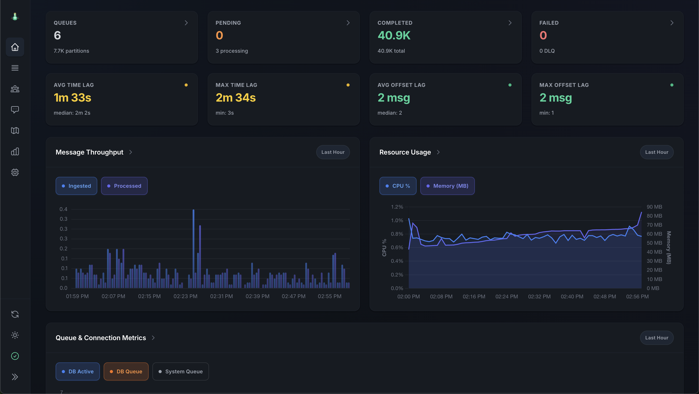

# Queen MQ - PostgreSQL-backed Message Queue

<div align="center">

**A modern, performant message queue system built on PostgreSQL**

[](LICENSE.md)
[](https://nodejs.org/)
[](https://en.cppreference.com/w/cpp/17)

📚 **[Complete Documentation](https://smartpricing.github.io/queen/)** • 🚀 **[Quick Start](https://smartpricing.github.io/queen/guide/quickstart)** • ⚖️ **[Comparison](https://smartpricing.github.io/queen/guide/comparison)**

<p align="center">
  
</p>

</div>

---

Queen MQ is a modern PostgreSQL-backed Message Queue, high-performance, feature-rich system with unlimited FIFO partitions, consumer groups, transactions, tracing and streaming capabilities with exact-once delivery guarantees.

## Why Queen?

Born at [Smartness](https://www.linkedin.com/company/smartness-com/) to power **Smartchat**, Queen solves a unique problem: **unlimited FIFO partitions** where slow processing in one partition doesn't block others.

Perfect for:
- Processing messages in order, without losing them somewhere in the middle
- Do not want that a slow message processing in one partition blocks other partitions 
- When you need thousands of thousands of partitions to process messages in parallel, respecting the order of the messages
- Process the same messages in multiple pipelines
- Have a clear view of the message processing flow and traceability
- Build event-driven microservices with exactly-once delivery guarantees
- Critical systems that need to be highly available and reliable with zero message loss

---

## Quick Start

```bash
# Start PostgreSQL and Queen
docker network create queen
docker run --name postgres --network queen \
  -e POSTGRES_PASSWORD=postgres -p 5432:5432 -d postgres

docker run -p 6632:6632 --network queen \
  -e PG_HOST=postgres -e PG_PASSWORD=postgres \
  smartnessai/queen-mq:{{VERSION}}

# Install client
npm install queen-mq
```

```javascript
import { Queen } from 'queen-mq'

const queen = new Queen('http://localhost:6632')

// Create queue
await queen.queue('orders')
  .config({ leaseTime: 30, retryLimit: 3 })
  .create()

// Push with guaranteed order per partition
await queen.queue('orders')
  .partition('customer-123')
  .push([{ data: { orderId: 'ORD-001', amount: 99.99 } }])

// Consume with consumer groups
await queen.queue('orders')
  .group('order-processor')
  .concurrency(10)
  .batch(20)
  .consume(async (message) => {
    await processOrder(message.data)
  })
```

**[Complete Tutorial →](https://smartpricing.github.io/queen/guide/quickstart)**

---

## Key Features

- 🎯 **Unlimited FIFO Partitions** - No limits on ordered message streams
- 👥 **Consumer Groups** - Kafka-style with replay from any timestamp
- 🔄 **Transactions** - Atomic push+ack for exactly-once delivery
- 📡 **Streaming** - Real-time message streams via WebSocket
- 🛡️ **Zero Message Loss** - Automatic failover to disk buffer
- 💀 **Dead Letter Queue** - Automatic handling of failed messages
- 🔍 **Message Tracing** - Debug distributed workflows
- 📊 **Modern Dashboard** - Vue 3 web interface with analytics
- 🔐 **Encryption** - Per-queue message encryption
- ⚡ **High Performance** - 200K+ msg/s with proper batching

**[Compare with Kafka, RabbitMQ, NATS →](https://smartpricing.github.io/queen/guide/comparison)**

---

## Performance

| Metric | Value |
|--------|-------|
| **Throughput** | 100K+ msg/s sustained |
| **Latency** | 10-50ms (POP/ACK), 50-200ms (TRANSACTION) |
| **Partitions** | Unlimited |

**[Detailed Benchmarks →](https://smartpricing.github.io/queen/server/benchmarks)**

---

## Webapp

A modern Vue 3 dashboard for monitoring and managing Queen MQ:

<div align="center">



</div>

**[Webapp Documentation →](https://smartpricing.github.io/queen/webapp/overview)**

---

## Documentation

📚 **[Complete Documentation](https://smartpricing.github.io/queen/)**

### Getting Started
- [Quick Start Guide](https://smartpricing.github.io/queen/guide/quickstart)
- [Installation](https://smartpricing.github.io/queen/guide/installation)
- [Basic Concepts](https://smartpricing.github.io/queen/guide/concepts)

### Client Libraries
- [JavaScript Client](https://smartpricing.github.io/queen/clients/javascript)
- [C++ Client](https://smartpricing.github.io/queen/clients/cpp)
- [HTTP API Reference](https://smartpricing.github.io/queen/api/http)

### Server
- [Architecture](https://smartpricing.github.io/queen/server/architecture)
- [Installation & Build](https://smartpricing.github.io/queen/server/installation)
- [Configuration](https://smartpricing.github.io/queen/server/configuration)
- [Environment Variables](https://smartpricing.github.io/queen/server/environment-variables)
- [Deployment (Docker, K8s, systemd)](https://smartpricing.github.io/queen/server/deployment)
- [Performance Tuning](https://smartpricing.github.io/queen/server/tuning)

### Features
- [Queues & Partitions](https://smartpricing.github.io/queen/guide/queues-partitions)
- [Consumer Groups](https://smartpricing.github.io/queen/guide/consumer-groups)
- [Transactions](https://smartpricing.github.io/queen/guide/transactions)
- [Long Polling](https://smartpricing.github.io/queen/guide/long-polling)
- [Streaming](https://smartpricing.github.io/queen/guide/streaming)
- [Dead Letter Queue](https://smartpricing.github.io/queen/guide/dlq)
- [Message Tracing](https://smartpricing.github.io/queen/guide/tracing)
- [Failover & Recovery](https://smartpricing.github.io/queen/guide/failover)

---

## Production Ready

Queen is currently running in production at [Smartness](https://www.linkedin.com/company/smartness-com/), handling **200k messages daily**.

Latest stable version: **{{VERSION}}**

---

## Community & Support

- 🌐 **Website**: [smartpricing.github.io/queen](https://smartpricing.github.io/queen/)
- 📦 **Docker Hub**: [smartnessai/queen-mq](https://hub.docker.com/r/smartnessai/queen-mq)
- 💼 **LinkedIn**: [Smartness Company Page](https://www.linkedin.com/company/smartness-com/)
- 🐛 **Issues**: [GitHub Issues](https://github.com/smartpricing/queen/issues)

---

## License

Queen MQ is released under the [Apache 2.0 License](LICENSE.md).

---

<div align="center">

**Built with ❤️ by [Smartness](https://www.linkedin.com/company/smartness-com/)**

*Why "Queen"? Because years ago, when I first read "queue", I read it as "queen" in my mind.*

</div>
