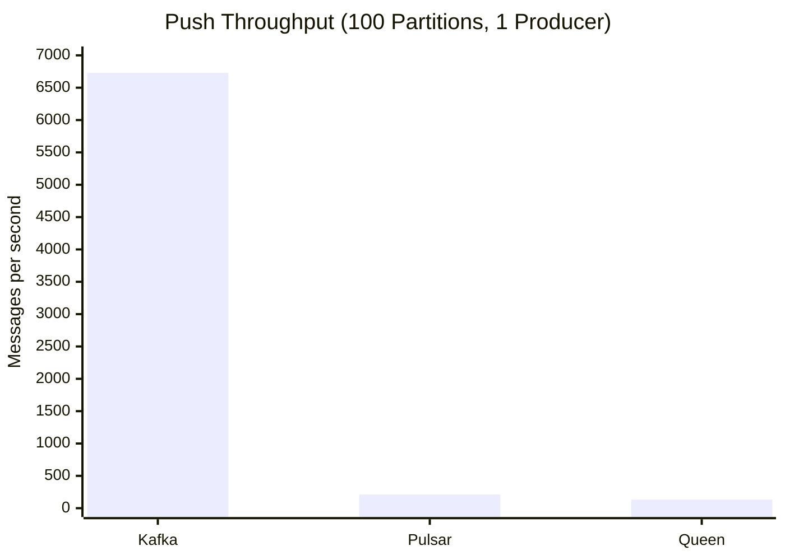
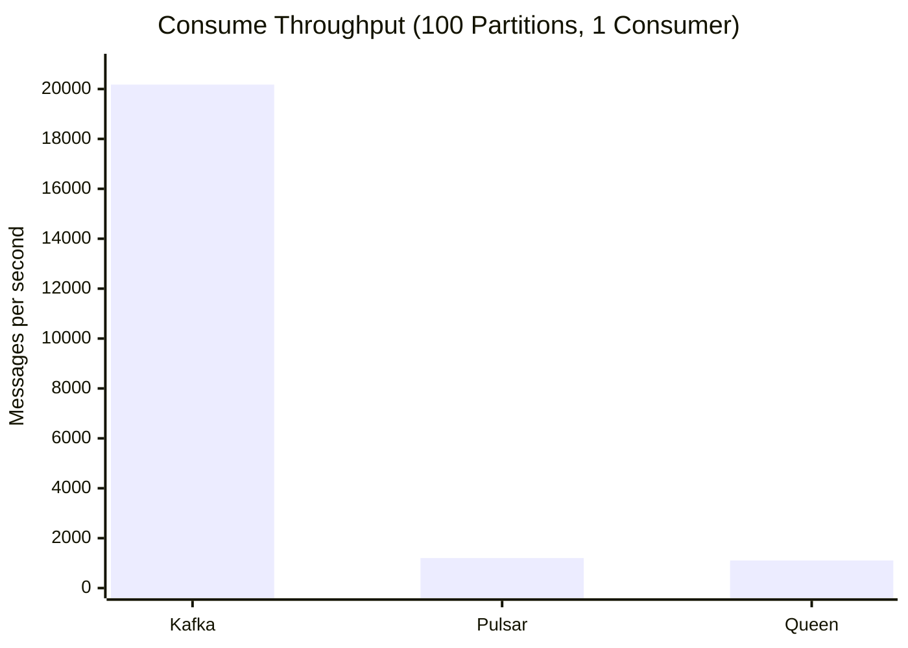
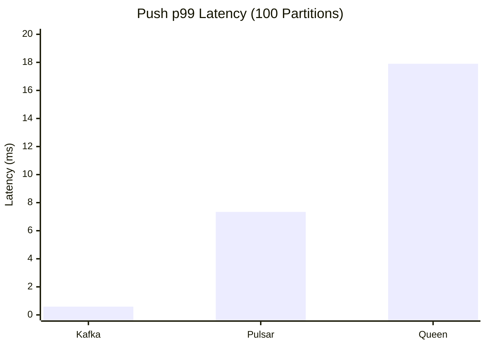
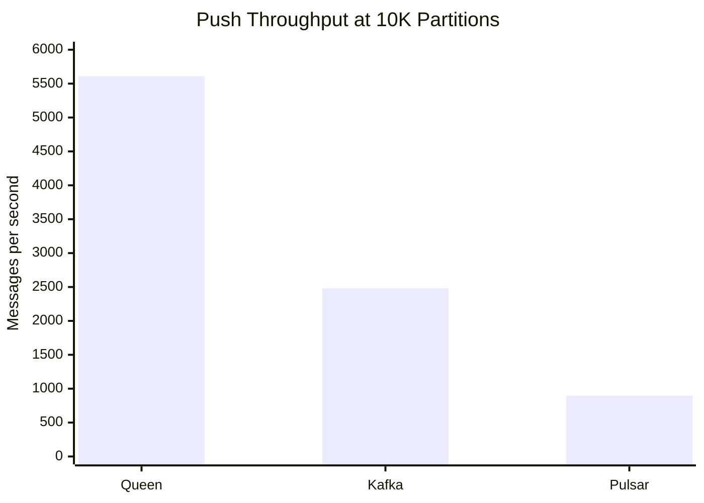
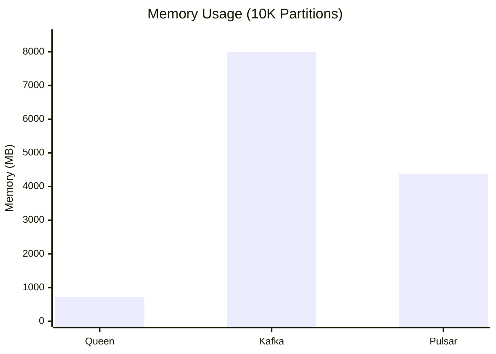

# Queen vs Kafka vs Pulsar Benchmark

A performance comparison of three message queue systems under high-partition, low-latency workloads without client-side batching.

## Overview

This benchmark evaluates **Queen MQ**, **Apache Kafka**, and **Apache Pulsar** in a specific but common scenario:

- **High partition count** (10,000 partitions target)
- **No client-side batching** (immediate message delivery)
- **Durable writes** (all systems configured for persistence)
- **Single-node deployment** (containerized, resource-limited to 4 cores / 8GB RAM)

This workload pattern is typical for:
- Multi-tenant systems with per-tenant queues
- Channel/chat managers with per-conversation ordering
- IoT platforms with per-device message streams
- Event sourcing with per-aggregate partitions

## Key Findings

### Partition Scalability at 10K Partitions

| System | 10K Partition Creation | Push Throughput | Status |
|--------|------------------------|-----------------|--------|
| **Queen** | ✅ Instant | **5,611 msg/s** | ✅ Full performance |
| **Kafka** | ⚠️ Required workaround | 2,483 msg/s | ⚠️ Severe degradation, hit 8GB limit |
| **Pulsar** | ❌ Architecture limitation | 898 msg/s | ❌ Unable to complete consume benchmark |

**Queen outperforms Kafka by 2.3x at 10K partitions** while using 10x less memory.

### Kafka at 10K Partitions: Struggles but Works

**Topic Creation Issues:**
- Kafka's default controller policy rejects creating 10K partitions in one batch (`PolicyViolationException: Unable to perform excessively large batch operation`)
- **Workaround required:** Create partitions incrementally in batches of 2,000
- Topic creation took ~40 seconds (vs instant for Queen)

**Performance Degradation:**
| Metric | 5K Partitions | 10K Partitions | Change |
|--------|---------------|----------------|--------|
| Push Throughput | ~8,000 msg/s | ~2,500 msg/s | **-69%** |
| Push p99 Latency | ~15ms | ~700ms | **+4500%** |
| Memory Usage | ~2.7GB | **8GB (hit limit)** | +200% |
| CPU Usage | ~85% | ~330% | +290% |

Kafka at 10K partitions on a single broker:
- Hit the 8GB memory limit
- Extreme latency spikes (p99 > 700ms, max > 2 seconds)
- Consumer group coordination becomes unstable with constant rebalancing

### Pulsar at 10K Partitions: Architectural Limitation

**The Problem:** Pulsar's partitioned topic model creates per-partition connections:
- Each producer connects to **ALL 10,000 partitions** internally
- Each consumer subscribes to **ALL 10,000 partitions** internally
- With 10 producers + 10 consumers: **200,000 internal connections**

**Result:**
- Producer creation took several minutes (creating 10K internal producers per client)
- Push throughput: ~900 msg/s (severely degraded)
- Consumer subscription creation **times out** before completing
- **Unable to complete the full benchmark**

This is a fundamental architectural difference, not a configuration issue:
- Queen: Partitions are table rows, no per-partition connections
- Kafka: Consumer groups assign partition subsets to each consumer
- Pulsar: Each client instance connects to ALL partitions by default

### Queen at 10K Partitions: No Issues

| Metric | Value |
|--------|-------|
| Push Throughput | **5,611 msg/s** |
| Push p99 Latency | 40.9ms |
| Consume Throughput | 3,248 msg/s |
| Memory (Queen + PostgreSQL) | **713 MB avg** |
| Topic/Partition Creation | Instant |

Queen maintains consistent performance regardless of partition count due to PostgreSQL's row-based storage model.

## Baseline Performance (1 Producer, 1 Consumer, 100 Partitions)

Single-threaded baseline to measure raw per-message performance without concurrency effects.

### Push Throughput



| System | Throughput | p50 Latency | p99 Latency | Memory |
|--------|------------|-------------|-------------|--------|
| **Kafka** | **6,729 msg/s** | 0.13ms | 0.59ms | 1,152 MB |
| **Pulsar** | 212 msg/s | 4.64ms | 7.34ms | 4,377 MB |
| **Queen** | 133 msg/s | 7.19ms | 17.90ms | 402 MB |

### Consume Throughput



| System | Throughput | p50 Latency | p99 Latency |
|--------|------------|-------------|-------------|
| **Kafka** | **20,177 msg/s** | <0.01ms | 0.002ms |
| **Pulsar** | 1,202 msg/s | 110.66ms | 139.90ms |
| **Queen** | 1,105 msg/s | 16.80ms | 40.29ms |

### Push Latency (p99)



### Analysis

At low partition counts with single producer/consumer, **Kafka dominates** due to:
- Optimized binary protocol (vs HTTP for Queen)
- Append-only log with sequential I/O
- OS page cache utilization

**Queen's HTTP overhead** is visible here (~7ms per request), but this becomes less significant when:
- Scaling to high partition counts (where Kafka degrades)
- Using concurrent producers (better HTTP connection utilization)
- Enabling client-side batching

**Pulsar** shows high consume latency due to batch receive timeout waiting for batches to fill.

---

## Performance at Scale (10K Partitions)

### Push Benchmark Results (60 seconds, 100 concurrent producers)



| System | Partitions | Throughput | p50 Latency | p99 Latency | Memory |
|--------|------------|------------|-------------|-------------|--------|
| **Queen** | 10,000 | **5,611 msg/s** | 16.9ms | 40.9ms | **713 MB** |
| **Kafka** | 10,000 | 2,483 msg/s | 7.6ms | 703ms | 8GB (limit) |
| **Pulsar** | 10,000 | 898 msg/s | 7.6ms | 56ms | N/A |

### Memory Usage at 10K Partitions



### Consume Benchmark Results

| System | Partitions | Throughput | Status |
|--------|------------|------------|--------|
| **Queen** | 10,000 | 3,248 msg/s | ✅ Completed |
| **Kafka** | 10,000 | ~40,000 msg/s | ⚠️ With rebalancing issues |
| **Pulsar** | 10,000 | N/A | ❌ Consumer creation timeout |

## Test Methodology

### Configuration

All systems were tested with equivalent settings:

| Setting | Value |
|---------|-------|
| Resource limits | 4 CPU cores, 8GB RAM |
| Client batching | Disabled (`linger.ms=0` equivalent) |
| Durability | Maximum (sync writes, acks=all) |
| Message size | 256 bytes |
| Test duration | 60 seconds per benchmark |
| Producers | 10 concurrent (100 for stress test) |
| Consumers | 10-20 concurrent |

### Durability Settings

| System | Configuration |
|--------|---------------|
| Queen (PostgreSQL) | `synchronous_commit=on` |
| Kafka | `acks=-1` (all replicas) |
| Pulsar | `journalSyncData=true`, `batchingEnabled=false` |

### Test Scenarios

1. **Push Benchmark**: Maximum throughput pushing to all partitions with concurrent producers
2. **Consume Benchmark**: Batch consumption with concurrent consumers and manual acknowledgment

## Running the Benchmark

### Prerequisites

- Docker and Docker Compose
- Node.js 22+
- ~16GB RAM available

### Quick Start

```bash
cd benchmark
npm install

# Run individually:
npm run start:queen && npm run setup:queen && npm run bench:queen && npm run stop:queen
npm run start:kafka && npm run setup:kafka && npm run bench:kafka && npm run stop:kafka
npm run start:pulsar && npm run setup:pulsar && npm run bench:pulsar && npm run stop:pulsar
```

### Configuration

Edit `config.js` to adjust parameters:

```javascript
export const config = {
  partitionCount: 10000,     // Number of partitions
  messageSize: 256,          // Payload size in bytes
  duration: 60,              // Test duration in seconds
  
  producer: {
    concurrency: 10,         // Concurrent producers
  },
  
  consumer: {
    concurrency: 10,         // Concurrent consumers
    batchSize: 100,          // Messages per batch
  },
};
```

## Understanding the Results

### When to Choose Each System

| Use Case | Recommended | Rationale |
|----------|-------------|-----------|
| High partition count (10k+) | **Queen** | 2.3x faster than Kafka, 6x faster than Pulsar at 10K partitions |
| Memory-constrained environment | **Queen** | Uses 713MB vs 3.6GB (Kafka) at 10K partitions |
| Maximum raw throughput | Kafka/Pulsar (with batching, <5K partitions) | Enable batching for their primary optimization |
| Simplest operations | **Queen** | Just PostgreSQL, no ZooKeeper/BookKeeper |

### Why This Matters

Traditional message brokers (Kafka, Pulsar) are optimized for:
- High throughput with batching
- Lower partition counts (hundreds, not thousands)
- Multi-broker deployments

Queen is optimized for:
- Many independent ordered streams (high partition count)
- Per-message durability without batching
- Operational simplicity

### Trade-offs

**Queen MQ**
- ✅ Handles unlimited partitions efficiently
- ✅ Lowest memory footprint
- ✅ Simple operations (PostgreSQL)
- ✅ ACID transactions across queues
- ⚠️ Lower raw throughput than dedicated brokers with batching

**Apache Kafka**
- ✅ Low latency at moderate partition counts
- ✅ Good throughput with batching
- ✅ Mature ecosystem
- ❌ Struggles with high partition counts (>5K per broker)
- ❌ Topic creation policy limits
- ❌ Memory scales with partition count

**Apache Pulsar**
- ✅ Separated storage/compute architecture
- ✅ Good performance at moderate partition counts
- ❌ Per-partition connection model doesn't scale
- ❌ Each client connects to ALL partitions
- ❌ Cannot effectively use 10K+ partitions

## Caveats

This benchmark intentionally tests a **specific workload pattern**. It does NOT represent:

- Kafka/Pulsar performance with batching enabled (their primary optimization)
- Multi-node cluster performance
- Replication and fault tolerance scenarios
- Long-term storage and compaction

**Important:** The `queen-mq` Node.js client used in this benchmark is designed for ease of use, not as a benchmarking tool. For direct HTTP API performance testing, use tools like `autocannon`.

The goal is to evaluate performance for workloads where:
- Many independent ordered streams are needed
- Low latency per message matters more than batch throughput
- Operational simplicity is valued

## Output Files

- `results-queen-{timestamp}.json` - Queen benchmark results
- `results-kafka-{timestamp}.json` - Kafka benchmark results  
- `results-pulsar-{timestamp}.json` - Pulsar benchmark results

## Reproducing Results

Results may vary based on:
- Host machine performance
- Docker resource allocation
- Background system load
- Storage I/O performance

For consistent results:
1. Run on a dedicated machine
2. Stop unnecessary background processes
3. Use SSD storage
4. Run multiple iterations

## License

Apache 2.0 - Same as Queen MQ
