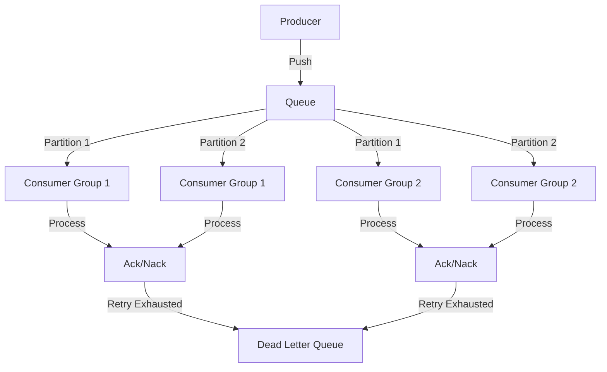

# Introduction to Queen MQ

Queen MQ is a modern, PostgreSQL-backed message queue system designed for high performance, reliability, and developer happiness. Born from the need to manage many FIFO partitions for [Smartchat](https://www.linkedin.com/company/smartness-com/) with solid guarantees around delivery and failure handling.

## What is Queen MQ?

Queen is a message queue system written in C++ that leverages PostgreSQL's reliability and ACID guarantees. It combines the best features from existing message queue systems like RabbitMQ, Kafka, and NATS into a unified, powerful platform.

:::info Why "Queen"?
Years ago, when the creator first read the word "queue", they read it as "queen" in their mind. The name stuck!
:::

## Key Features

### 🎯 Unlimited FIFO Partitions
Create as many ordered partitions as you need within each queue. Messages in the same partition are guaranteed to be processed in order, with automatic lock management to ensure only one consumer processes a partition at a time.

### 👥 Consumer Groups
Kafka-style consumer groups allow multiple groups to process the same messages independently. Each group tracks its own position and can start from the beginning, from a specific timestamp, or only process new messages.

### 🔄 Transactions
Atomic operations across queues with exactly-once delivery guarantees. Chain push and ack operations together to build reliable workflows that never lose or duplicate messages.

### 📡 Streaming
Real-time message streaming. Build aggregation pipelines and process messages as they arrive with partitioned streams and filtering capabilities.

### ⏱️ Long Polling
Efficient server-side waiting for messages. No busy loops, no wasted resources. Messages are delivered instantly when they become available.

### 🛡️ Zero Message Loss
Automatic failover to disk when PostgreSQL is unavailable. Messages are buffered locally and automatically replayed when the database recovers. Survives crashes and restarts.

### 💀 Dead Letter Queue
Automatic handling of failed messages. Configure retry limits and have messages automatically routed to the dead letter queue for debugging and manual intervention.

## Architecture Highlights

- **High Performance**: Handle 200K+ messages/second with proper batching
- **C++17**: Modern C++ with uWebSockets for high-performance networking
- **Async PostgreSQL**: Fully asynchronous, non-blocking database operations
- **Horizontal Scaling**: Multiple server instances with automatic load distribution
- **Modern Dashboard**: Beautiful Vue 3 web interface for monitoring and management

## Use Cases

### Enterprise Workflows
Build multi-step workflows with transactional guarantees:
- Order processing pipelines
- Financial transaction systems
- Data transformation pipelines
- Multi-stage approval processes

### Real-time Analytics
Stream messages to multiple consumer groups for different purposes:
- Real-time metrics aggregation
- Business intelligence dashboards
- Log aggregation and analysis
- Event monitoring

### Event-Driven Architecture
Decouple microservices with guaranteed message delivery:
- Service-to-service communication
- Event sourcing
- CQRS patterns
- Saga orchestration

### Task Queues
Distribute work across multiple workers:
- Background job processing
- Video transcoding
- Report generation
- Email delivery

## How It Works

## Design Principles

1. **Developer First**: Simple, intuitive APIs that make complex workflows easy
2. **Performance**: Built for speed with async I/O and minimal overhead
3. **Reliability**: ACID guarantees, automatic failover, zero message loss
4. **Flexibility**: Support multiple messaging patterns (queue, pub/sub, streaming)
5. **Observability**: Built-in tracing, metrics, and beautiful dashboard

## Comparison with Other Systems

| Aspect | Queen | RabbitMQ | Kafka | NATS |
|--------|-------|----------|-------|------|
| **Storage** | PostgreSQL | Disk | Disk | Memory/File |
| **Partitions** | Unlimited | N/A | Limited | N/A |
| **Consumer Groups** | ✅ Native | ⚠️ Pattern | ✅ Native | ✅ Queue Groups |
| **Transactions** | ✅ Atomic | ⚠️ Complex | ⚠️ Producer | ❌ |
| **Replay** | ✅ Timestamp | ❌ | ✅ Offset | ⚠️ Limited |
| **Dashboard** | ✅ Modern | ⚠️ Basic | ⚠️ External | ⚠️ External |
| **Setup** | Docker | Complex | Complex | Simple |

## Performance Metrics

Based on benchmarks with Apple M4 Air (all components on same machine):

- **Producer Peak**: 90K+ messages/second
- **Consumer Peak**: 488K+ messages/second (with batch size 1000)
- **Latency**: 10-50ms for POP/ACK operations
- **Throughput**: Scales linearly with batch size

See the [Benchmarks](/server/benchmarks) page for detailed performance data.

## Getting Started

Ready to dive in? Check out the [Quick Start Guide](/guide/quickstart) to get Queen MQ running in minutes.

Or explore specific topics:
- [Basic Concepts](/guide/concepts) - Understand queues, partitions, and consumer groups
- [JavaScript Client](/clients/javascript) - Start building with the JS client
- [Python Client](/clients/python) - Start building with the Python client
- [C++ Client](/clients/cpp) - High-performance C++ client
- [Server Setup](/server/installation) - Install and configure the server
- [Examples](/clients/examples/basic) - See real-world usage patterns

## Community

Queen MQ is built and maintained by [Smartness](https://www.linkedin.com/company/smartness-com/), powering their hospitality platform with millions of messages daily.

- **GitHub**: [github.com/smartpricing/queen](https://github.com/smartpricing/queen)
- **Docker Hub**: [smartnessai/queen-mq](https://hub.docker.com/r/smartnessai/queen-mq)
- **License**: Apache 2.0

Join us in building the next generation of message queue systems!

